# HTML

##### 阶段目标：

##### 使用HTML进行网页布局

##### 使用CSS3美化网页

##### 制作精美的商业网站

##### 【演示】 常见网站的样子！这就是我们未来要做的事情

##### 安排

##### HTML

##### 1. HTML基础

##### 2. 列表、表格

##### 3. 媒体元素

##### 4. 表单（重点）

##### CSS

##### 1. 初始CSS3 （重点）

##### 2. CSS3美化网页元素（重点）

##### 3. 盒子模型（重点、难点）

##### 4. 浮动（重点、难点）

##### 5. 定位网页元素（重点、难点）

##### 6. 利用CSS3制作网页动画（难点）

##### 7. 开发一个完整的商业网站静态模板

##### 学习规范：

##### 1. 制作网页时，要保证代码的规范度

##### 2. 多模仿、多练习，选择感兴趣的页面进行制作

##### 3. 前端的学习就是模仿，这是最快的方式

## 1 、HTML 基础

##### 目标：

##### 会使用HTML5的基本结构创建网页

##### 会使用文本相关标签排版文本信息

##### 会使用图像相关标签实现图文并茂的页面

##### 会使用标签创建超链接、锚链接及功能性链接

## 1.1、什么是HTML


HTML：Hyper Text Markup Language（超文本标记语言）

**超文本包括：文字、图片、音频、视频、动画等**

##### 1. 网页的组成

##### 2. 标签作用是什么

##### 3. 浏览器打开后，会从上到下解释这些代码，并呈现相应的效果

### 1.2、发展史、优势
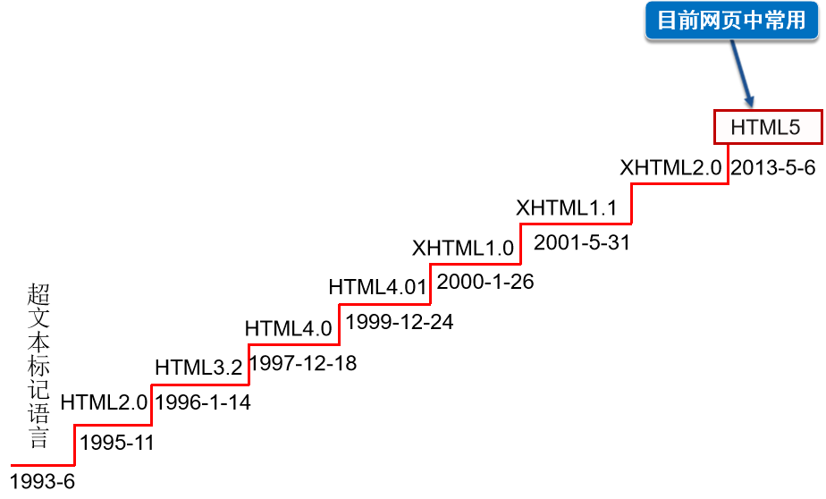
```
HTML：Hyper Text Markup Language超文本标记语言
超文本标记语言—在 1993 年 6 月互联网工程工作小组工作案发布（并非标准）
HTML2.0—1995年 11 月作为RFC1866发布，在RFC2854于 2000 年 6 月发布之后被宣布过时。
HTML3.2—1996年 1 月 14 日，W3C推荐标准
HTML4.0—1997年 12 月 18 日，W3C推荐标准
HTML4.01（微小改进）—1999年 12 月 24 日，W3C推荐标准， 2000 年 5 月 15 日发布基本严格的
HTML4.01语法，是国标标准化组织和国际电工委员会的标准
XHTML1.0—发布于 2000 年 1 月 26 日，是W3C推荐标准，后来经过修订于 2002 年 8 月 1 日重新发布
XHTML1.1—2001年 5 月 31 日发布
```

##### XHTML2.0是W3C的工作草案，由于改动过大，学习这个新技术的成本过高而最终胎死腹中，因

##### 此，现在最常用的还是XHTML1.0标准。

##### 目前最新的版本为HTML5，它是 2004 年被提出， 2007 年被W3C接纳并成立新的HTML工作团队，

##### 2008 年 1 月 22 日公布HTML5第一份正式草案， 2012 年 12 月 17 日HTML5规范正式定稿， 2013 年 5 月

##### 6 日，HTML5.1正式草案公布。

##### HTML 5作为最新版本，提供了一些新的元素和一些有趣的新特性，同时也建立了一些新的规则。

##### 这些元素、特性和规则的建立，提供了许多新的网页功能，如使用网页实现动态渲染图形、图表、

##### 图像和动画，以及不需要安装任何插件直接使用网页播放视频等。目前企业开发中也在增大使用

##### HTML5的力度

##### HTML5的优势

##### 世界知名浏览器厂商对HTML5的支持

通过对Internet Explorer、Google、Firefox、Safari、Opera等主要的Web浏览器发展策略调查，发现

他们都在支持HTMl5上采取措施。

**微软** ： 2010 年 3 月 16 日，微软于拉斯维加斯市举行的MIX10技术大会上宣布已推出IE9浏览器开发者预览

版。此版本将更多的支持CSS3、SVG和HTML5等互联网浏览通用标准。

**Google** ： 2010 年 2 月 19 日，谷歌Gears项目经理伊安一费特通过博客宣布，谷歌将放弃对Gears浏览器

插件项目的支持，以此重点开发HTML5项目。

**苹果** ： 2010 年 6 月 7 日，苹果在开发者大会的会后发布了Safari 5，这款浏览器支持 10 个以上HTML5新技

术，包括全屏播放、HTML5视频、HTML5地理位置、HTML5的形式验证等功能。

**Opera** ： 2010 年 5 月 5 日，Opera软件公司首席技术官Hakon Wium Lie先生在访华之际，接受中国软件

资讯网等少数几家媒体采访，他认为HTMl5和CSS3将是全球互联网发展的未来趋势。

**mozilla firefox** ： 2010 年 7 月，Mozilla基金会发布了Firefox 4浏览器的第一个测试版，从官方文档看，

它对HTML5是完全级别的支持。

以上证据表明，目前这些浏览器已经纷纷朝着支持HTML5、结合HTML5的方向迈进，因此HTML5已经

被广泛的推行开来。

**2 ．市场的需求**

现在的市场已经迫不及待的要求有一个统一的互联网通用标准。HTML5之前的情况是，由于各浏览器之

间的不统一，光是修改Web浏览器之间的由于兼容性而引起的bug就浪费了大量的时间。而HTML5的目

标就是将Web带入一个成熟的应用平台，在HTML5平台上，视频、音频、图像、动画以及同电脑的交互

都被标准化。

**3 ．跨平台**

HTML5可以做到跨平台开发，用户只用打开浏览器即可访问应用，PC网站、各种移动设备、插件等核心

代码就可以不需要重复编写，极大的减少了开发人员的工作量。

### 1.3、W3C标准

##### W3C

```
World Wide Web Consortium（万维网联盟）
成立于 1994 年，Web技术领域最权威和具影响力的国际中立性技术标准机构
http://www.w3.org/
http://www.chinaw3c.org/
W3C标准包括
```
```
结构化标准语言（XHTML 、XML）
表现标准语言（CSS）
行为标准（DOM、ECMAScript ）
```

##### 演示示例 1 ：静夜思

##### 常见的网页编辑工具IDE：

##### 记事本

```
NotePad++
Sublime
```
```
VsCode
```
```
WebStorm
```
```
HBuidler
```
```
IDEA
```
```
....
没有最好的，只有最合适的。就像那句话：技术没有高低之分，只有使用技术的人有强弱之别
```
### 1.4、HTML基本结构

##### HTML网页基本结构

##### 1. 强调HTML标签都以“< >”开始、“</ >”结束

##### 2. 说明网页基本结构中这几个标签的用法

##### 3. 网页中所有的内容都放在之间
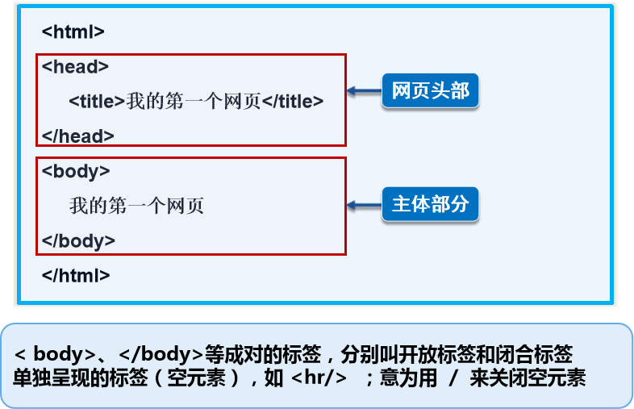
```
<!DOCTYPE html>
<html lang="en">
<head>
<meta charset="UTF-8">
<title>静夜思</title>
</head>
<body>
```
```
<h1>静夜思</h1>
<em>朝代:唐代</em> &nbsp;&nbsp; 作者:<strong>李白</strong></em><br/>
<hr/>
原文：
<p>
床前明月光，<br/>
疑是地上霜。<br/>
举头望明月，<br/>
低头思故乡。<br/>
</p>
```
```
</body>
</html>
```

##### 网页基本信息

##### DOCTYPE声明

```
百度搜索DOCTYPE声明，查看菜鸟教程：https://www.runoob.com/tags/tag-doctype.html
```
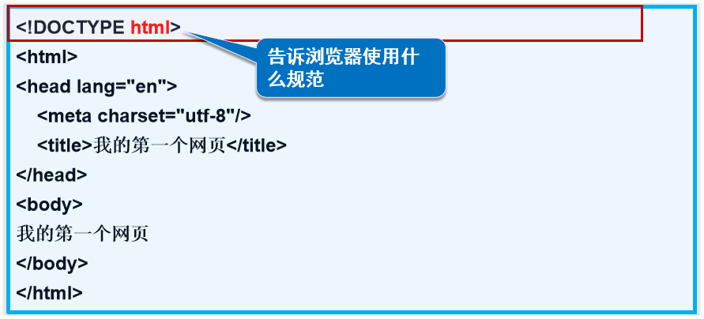

```
<!DOCTYPE html>
<html lang="en">
<head>
<meta charset="UTF-8">
<title>狂神说Java</title>
<meta charset="UTF-8">
<meta name="keywords" content="狂神说Java,秦疆"/>
<meta name="description" content="学Java，听狂神说"/>
</head>
<body>
```
```
</body>
</html>
```


< title>标签
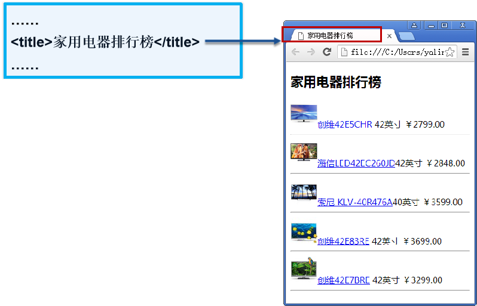

< meta>标签

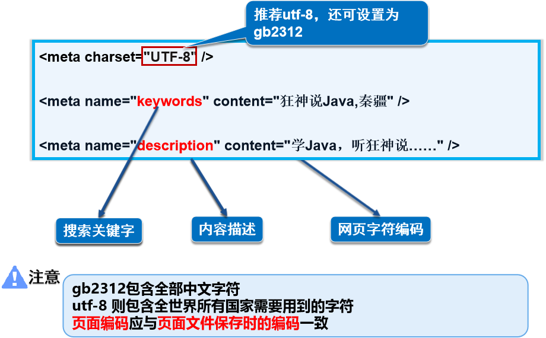
详细讲解字符编码在网页中的作用，网页常用的字符编码有gb2312、utf-8，两者之间的区别。


### 1.5、网页的基本标签

#### 1 、标题标签

##### 先讲解标题标签代码写法，说明标题标签在网页中的作用，通常用于标题或主题，体现标签语义

##### 化。

```
h1最大，h6最小，对比效果图讲解
最后演示示例，演示效果图
```
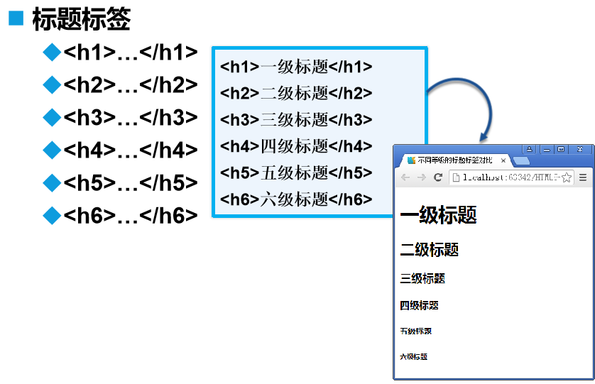
#### 2 、段落标签

#### 3 、换行标签
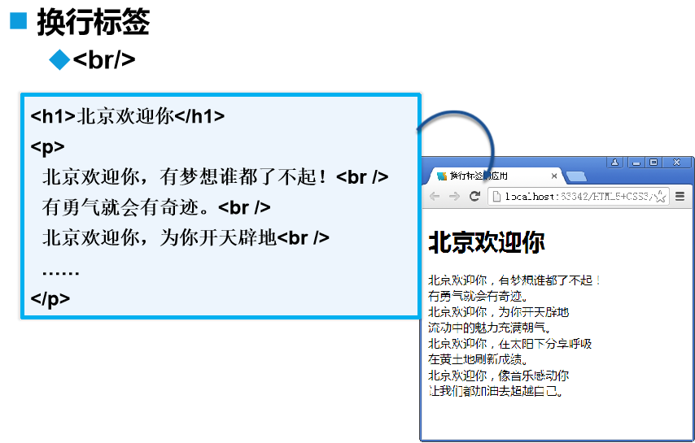
##### 换行标签，查看效果图,看段落标签和换行标签的不同

```
<h1>秦疆</h1>
<h2>秦疆</h2>
<h3>秦疆</h3>
<h4>秦疆</h4>
<h5>秦疆</h5>
<h6>秦疆</h6>
```


#### 4 、水平线标签
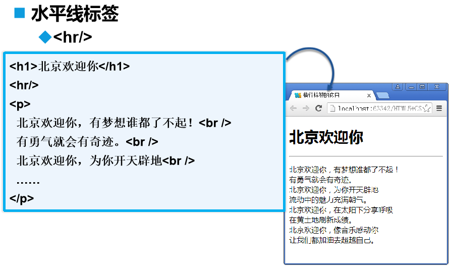
#### 5 、字体样式标签
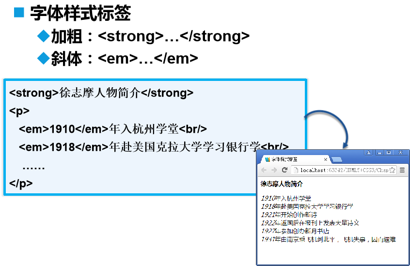

#### 6 、注释和特殊符号

##### 注释

##### 特殊符号
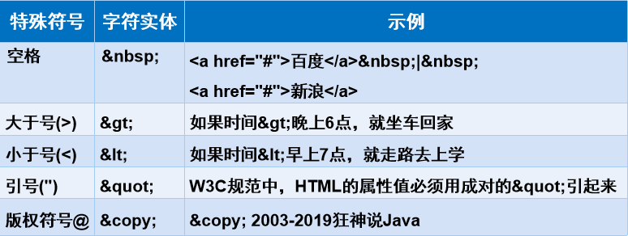
##### 1 <!--我是注释-->

```
<!DOCTYPE html>
<html lang="en">
<head>
<meta charset="UTF-8">
<title>特殊符号</title>
</head>
<body>
```
##### <!--空格-->

```
<p>
狂神说 Java<br/>
狂神说 Java<br/>
狂神说&nbsp;&nbsp;&nbsp;&nbsp;Java<br/>
</p>
```


### 1.6、图像标签

常见的图像格式：jpg、gif、png、bmp、

说明JPG、gif是网页中最常用的格式，PNG受浏览器兼容性的限制

**说明：**

```
1. 先讲解图像语法，对每个参数详细讲解，并且强调说明alt属性和title属性在什么情况下可以看到替
代文字和提示文字，并且说明alt属性常和src配合使用。
2. 说明img标签的与之前学习的< br/>标签一样，不是成对的标签，直接在最后以“/”闭合，体现标签
的语义化。
```
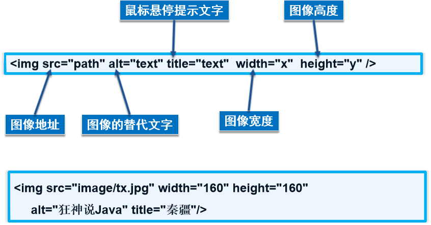
### 1.7、链接标签

##### <!--大于小于-->

```
<p>
> < <br>
&gt; &lt;
</p>
```
##### <!--引号-->

```
<p>
&quot;狂神&quot;
</p>
```
##### <!--版权-->

```
<p>
&copy; 2017-2019 狂神说Java
</p>
```
```
<!--万能的公式 &符号+xxx -->
```
```
</body>
</html>
```


##### 页面间链接：从一个页面链接到另外一个页面

##### 锚链接

##### 功能性链接

##### 说明：

##### 讲解语法，详细说明每个参数的用法，强调一下路径的表示方法，相对路径和绝对路径，说明

```
target常用值为 self 和blank，还有其他值，以后用到再讲。
讲解给出的例子代码，一个文本超链接一个图像超链接
最后演示，只演示超链接效果即可，演示时更改target的参数，让学员看到目标窗口打开的不同位
置。
从这里开始，学员第一次接触在网页中插入图片，说明图片经常保存在image或images目录下，
以保证网站目录清淅
```

##### 锚链接
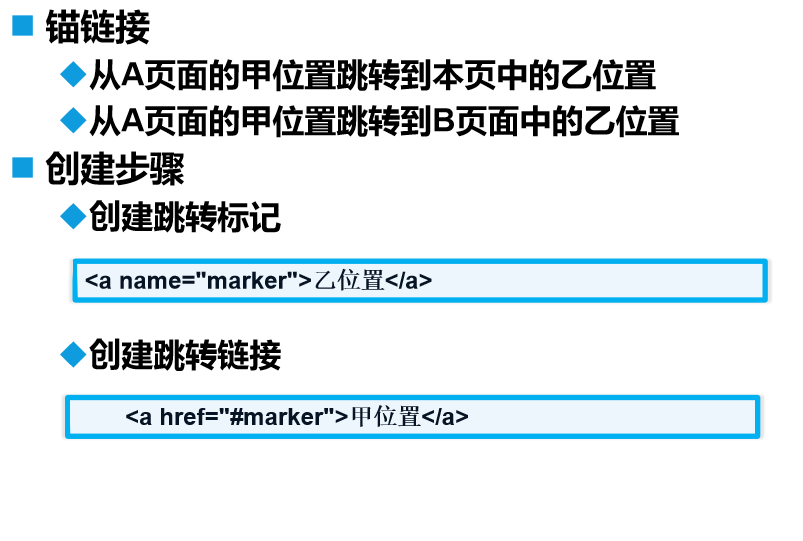

##### 【两种操作都演示一下】

##### 功能性链接

##### 这几种都是常用的功能性链接，例如在网上单击一些QQ图标直接弹出QQ对话框，或单击MSN图标直接

##### 弹出MSN对话框，这些都是使用了功能有性链接


### 1.8、行内元素和块元素
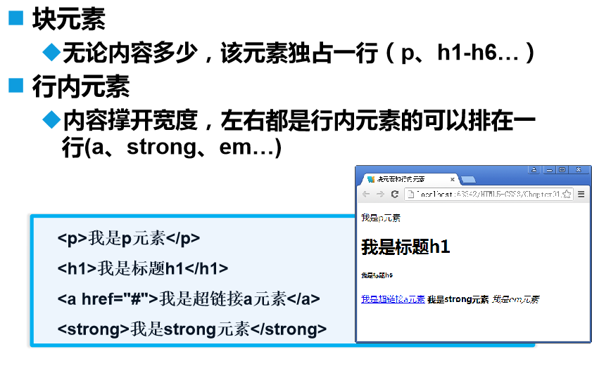

### 1.9、作业和总结

##### 作业：制作一个博客文章页面，实现图文并茂 + 锚链接跳转到指定小节

##### 总结：
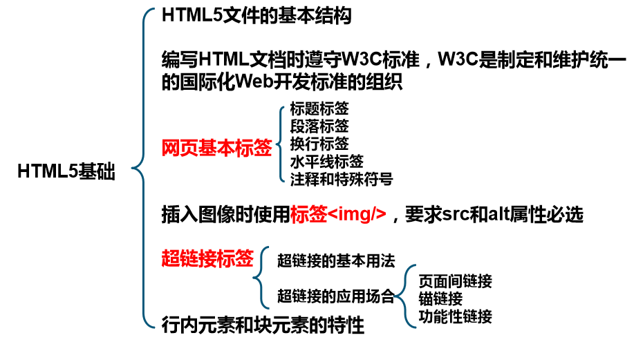
## 2 、列表、表格与媒体元素

##### 本章任务

##### 使用列表展示数据

##### 使用表格展示数据

##### 使用媒体元素在网页中播放视频


##### 使用HTML5结构元素进行网页布局

### 2.1、列表

##### 无序列表和定义列表在网页制作中应用非常广泛

##### 什么是列表：

##### 列表就是信息资源的一种展示形式。它可以使信息结构化和条理化，并以列表的样式显示出来，以

##### 便浏览者能更快捷地获得相应的信息。

##### 无序列表
``` html
<!--ul 声明无序列表-->
<ul>
	<!--li 声明列表项-->
	<li>语文</li>
	<li>数学</li>
	<li>英语</li>
	<li>计算机</li>
</ul>
```
##### 列表项中可以包含图片、文本，还可以嵌套列表、其他标签等

##### 无序列表的 特性

```
没有顺序，每个< li>标签独占一行（块元素）
默认< li>标签项前面有个实心小圆点
一般用于无序类型的列表，如导航、侧边栏新闻、有规律的图文组合模块等
```
##### 有序列表
<!--ol 声明有序列表-->
<ol>
	<!--li 声明列表项-->
	<li>语文</li>
	<li>数学</li>
	<li>英语</li>
	<li>计算机</li>
</ol>
##### 有序列表默认以数字序号显示

##### 有序列表与无序列表一样，也可以嵌套列表、可以包含图片、文本、其他标签等

##### 有序列表的 特性


- 有顺序，每个< li>标签独占一行（块元素）
- 默认< li>标签项前面有顺序标记
- 一般用于排序类型的列表，如试卷、问卷选项等

##### 自定义列表
``` html
<!--dl 声明定义列表-->
<dl>
<!--dt 声明列表项-->
<dt>水果</dt>
<!--dd 定义列表项内容-->
<dd>苹果</dd>
<dd>桃子</dd>
<dd>李子</dd>
</dl>
```
##### 定义列表也可以嵌套列表、包含图片、文本、其他标签等

##### 以后的网页制作中经常会用到定义列表，特别是图文混排的情况

##### 定义列表的 特性


- 没有顺序，每个< dt>标签、< dd>标签独占一行（块元素）
- 默认没有标记
- 一般用于一个标题下有一个或多个列表项的情况

##### 小结：列表对比

##### 列表之间可以互相嵌套，进行页面的局部布局

##### 练习：
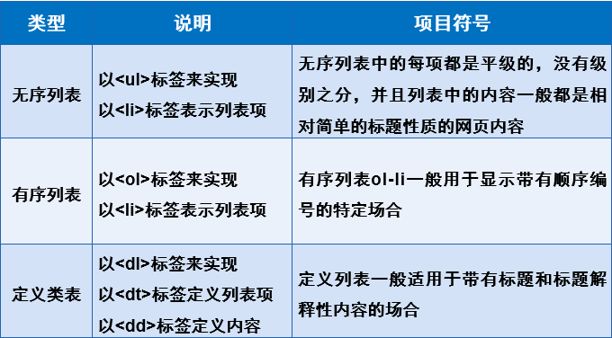


### 2.2、表格
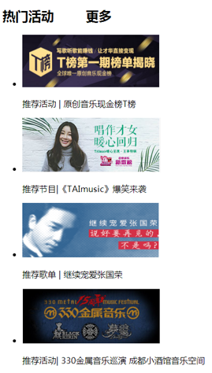
##### 为什么使用表格

##### 简单通用

##### 结构稳定

##### 基本结构

##### 单元格

##### 行

##### 列

##### 表格的基本语法

``` html
<!--table表格标签-->
<table border="1px">
<!--tr 行标签-->
<tr>
<!--td 单元格标签-->
<td>第 1 个单元格的内容</td>
<td>第 2 个单元格的内容</td>
......
</tr>
<tr>
<td>第 1 个单元格的内容</td>
<td>第 2 个单元格的内容</td>
......
</tr>
</table>
```


##### 表格的跨列

``` html
<table>
<tr>
<!--colspan 所跨的列数-->
<td colspan="n">单元格内容</td>
</tr>
<tr>
<td>单元格内容</td>
......
</tr>
......
</table>
```
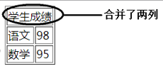

```
<table >
<tr>
<!--rowspan 所跨的行数-->
<td rowspan="n">&nbsp;</td>
<td>&nbsp;</td>
</tr>
<tr>
<td>&nbsp;</td>
</tr>
</table>
```
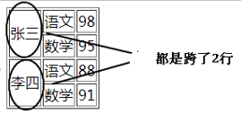


##### 表格的跨行和跨列
``` html
<tr>
<!--跨列-->
<td colspan="3">学生成绩</td>
</tr>
<tr>
<!--跨行-->
<td rowspan="2">张三</td>
<td>语文</td>
<td> 98 </td>
</tr>
```
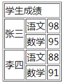
### 2.3、音频、视频

##### 如何实现在网页上播放视频和音频？

- 第三方自主开发的播放器
- Flash
- HTML5媒体元素

在HTML5问世之前，要在网页上展示视频、音频、动画等，除了使用第三方自主开发的播放器外，使用

最多的工具应该算是Flash了，但是它需要在浏览器上安装各种插件才能使用，有时候速度也会非常慢。

HTML5的出现改变了这一状况，在网页中使用HTML5来播放音频、视频再也不需要安装插件，只需要一

个支持HTML5的浏览器就可以了。

##### 视频标签
```
src：指定要播放的视频文件的路径
controls：提供播放、暂停和音量的控件
autoplay：自动播放属性
loop：视频的循环播放
<video src="视频路径" controls autoplay></video>
```
##### 音频标签
``` html
src：指定要播放的音频文件的路径
trols：提供播放、暂停和音量的控件
<audio src="音频路径" controls autoplay></video>
```
### 2.4、页面结构分析
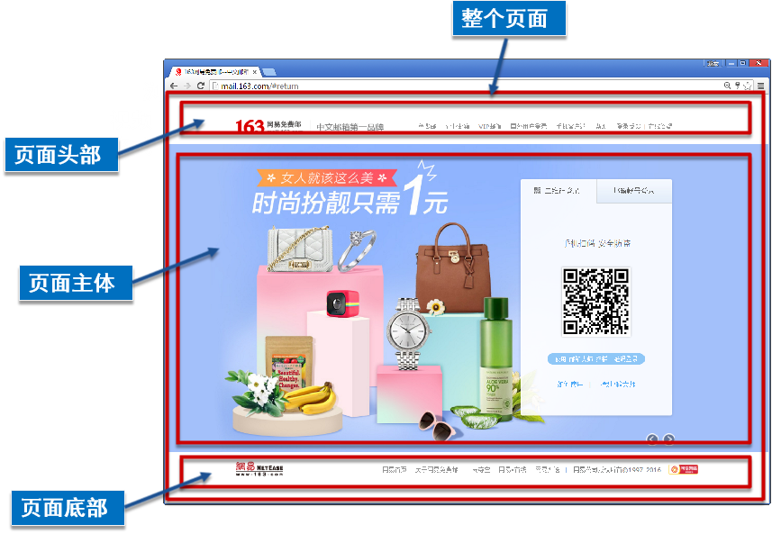
##### HTML5结构元素
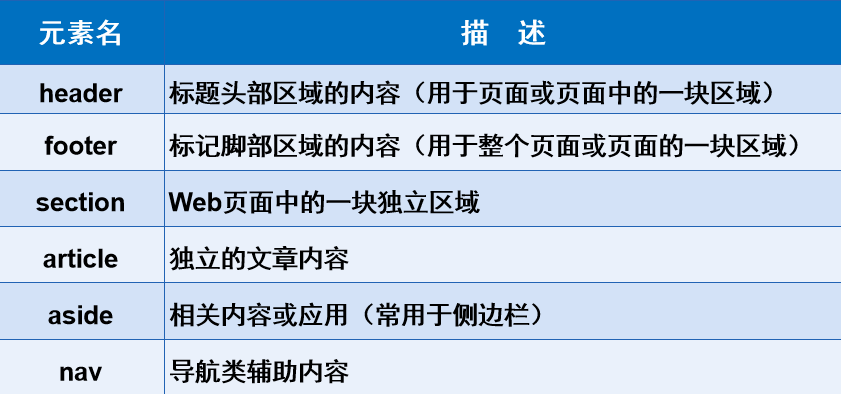
### 2.5、内联框架

iframe 单页面内联
```
src：引用页面地址
name：框架标识名
<iframe src="path" name="mainFrame" ></iframe>
```
iframe属性（实现页面间的相互跳转）
```
在被打开的框架上加name属性
<iframe name="mainFrame"></iframe>
在超链接上设置target目标窗口属性为希望显示的框架窗口名
<a href="https://www.baidu.com/" target="mainFrame">加载</a>
```
### 2.6、小结
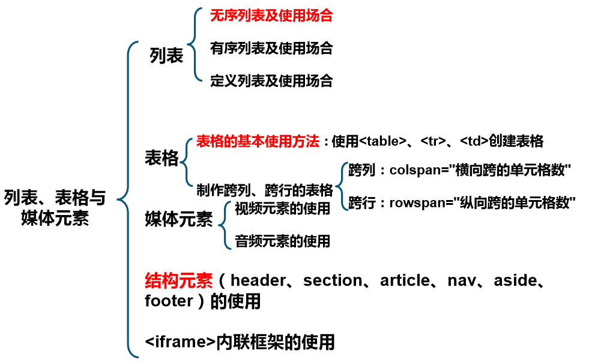
## 3 、表单

##### 本章目标

- 会使用表单元素布局表单

- 会制作语义化的表单

- 会使用HTML5属性初步验证表单

##### 提问：大家在上网时，看到的表单在网页中的应用有哪些？

- 登录

- 注册

### 3.1、表单语法

``` html
method: 规定如何发送表单数据常用值：get post
在实际网页开发中通常采用post方式提交表单数据
action: 表示向何处发送表单数据
<form method="post" action="result.html">
<p>名字：<input name="name" type="text" > </p>
<p>密码：<input name="pass" type="password" > </p>
<p>
<input type="submit" name="Button" value="提交"/>
<input type="reset" name="Reset" value="重填"/>
</p>
</form>
```


- 讲解表单的创建方法，以及method和action的作用
- 分别把method的值设置为get和post，然后提交表单，查看页面效果；通过演示可看到method设
置不同值时，表单数据在地址栏显示的不同情况
- 最后根据演示情况说明get和post两者的区别
- 最后总结：post方式提交的数据安全性要明显高于get方式提交的数据。因此在实际开发中通常采
用post方式提交表单数据。

### 3.2、 13 个表单元素

##### 1 、文本框
```
<!--type="text"
name：文本框名称(必填)
value：文本框初始值
size：文本框长度
maxlength：文本框可输入最多字符
-->
<input type="text" name="userName" value="用户名" size="30" maxlength="20"
/>
```
##### 2 、密码框

##### 向密码框中输入字符时，显示的效果，密码字符以黑色实心的圆点来显示。
```
<!--type="password"
name：密码框名称(必填)
size：密码框长度
-->
<input type="password" name="pass" size="20"/>
```
##### 3 、单选按钮

同一组单选按钮，name属性值必须相同，才能在选中单选按钮时达到互斥

``` html
<!--type="radio"
name：单选框名称(必填)，一组的名称需要相同
checked：单选按钮选中状态
value：单选框的值
-->
<input name="gen" type="radio" value="男" checked />男
<input name="gen" type="radio" value="女" />女
```


##### 4 、复选框

同一组复选框，根据需要可设置name属性值相同

```
<!--type="checkbox"
name：复选框名称(必填)，一组的名称需要相同
checked：复选按钮选中状态
value：复选框的值
-->
<input type="checkbox" name="interest" value="sports"/>运动
<input type="checkbox" name="interest" value="talk" checked />聊天
<input type="checkbox" name="interest" value="play"/>玩游戏
```
##### 5 、下拉列表框

```
一个<select>中至少包含一下<option>
```
希望在页面加载时有默认选中的选中项，则必须使用selected属性，如果没有默认选中项则第一个选项

默认被选中；演示时改变size的值和selected默认值，让学员看显示效果，加深对这两个属性的理解。
``` html
<!--select:下拉列表框-->
<!--option：选项-->
<select name="列表名称" size="行数">
<option value="选项的值" selected="selected">...</option >
<option value="选项的值">...</option >
</select>
```

##### 6 、按钮
``` html
<!--重置按钮-->
<input type="reset" name="butReset" value="reset按钮">
<!--提交按钮-->
<input type="submit" name="butSubmit" value="submit按钮">
<!--普通按钮-->
<input type="button" name="butButton" value="button按钮"/>
<!--图片按钮-->
<input type="image" src="images/login.gif" />
```

##### 单击三个按钮，让学员看三个按钮提交后显示的不同效果，主要演示提交按钮和重置按钮，提一下普通

按钮是需要添加onclick事件的，后期课程会讲解，这里稍微提一下就可以了。

有时会使用图片代替按钮，讲解图片按钮的用法，强调type和src属性，强调“type”属性没有设置为

“submit”，但仍然具备提交表单的功能。


##### 7 、多行文本域

改变cols和rows的值，让学员看到由于这两个值的改变，文本框内容显示的改变。强调多行文本域的内

容是在标签之间。
``` html
textarea：多行文本域
cols：显示的列数
rows：显示的行数
```
```
<textarea name="showText" cols="x" rows="y">文本内容 </textarea>
```

##### 8 、文件域

在表单中使用文件域时，必须设置表单的“enctype”编码属性为“multipart/form-data”，表示将表单数据

分为多部分提交。未来文件上传和下载会详细讲解，现在了解即可！
```
enctype：表单编码属性
```
```
<form action="" method="post" enctype="multipart/form-data">
<p>
<!--type="file" 文件域-->
<input type="file" name="files" />
<input type="submit" name="upload" value="上传" />
</p>
</form>
```

##### 9 、邮箱

会自动验证Email地址格式是否正确

```
1 邮箱:<input type="email" name="email"/>
```

##### 10 、网址
```
1 请输入你的网址:<input type="url" name="userUrl"/>
```
##### 会自动验证URL地址格式是否正确

##### 11 、数字
``` html
min：最小值
max：最大值
step：步长

请输入数字:<input type="number" name="num" min="0" max="100" step="10"/>
```

##### 12 、滑块

type值为range即为滑块。
``` html
1 请输入数字:<input type="range" name="range1" min="0" max="10" step="2"/>
```

##### 13 、搜索框

type值为search即为搜索框。
```
1 请输入搜索的关键词:<input type="search" name="sousuo"/>
```

### 3.3、练习

##### 人人网界面练习
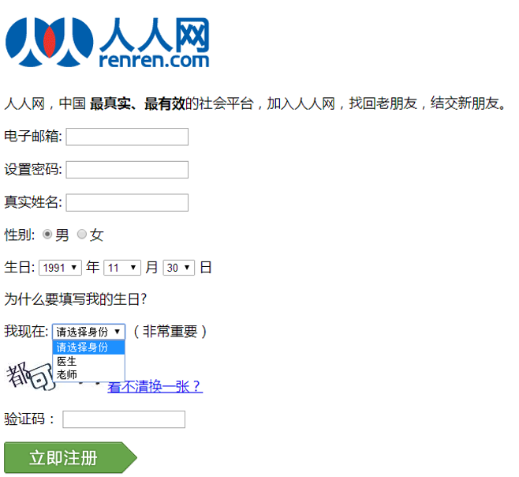
##### 阿里巴巴界面练习


### 3.4、表单的高级应用

##### 在某些注册页面或本图片中订单信息页面，必须同意一些条款按钮才能使用等等


##### 隐藏域

##### 在浏览器中看不到隐藏域，但是在提交表单时可以看到隐藏域的内容被提交至服务器

```
1 <input type="hidden" value="666" name="userid">
```
##### 只读、禁用

##### W3C HTML5标准中，规定对于布尔类型的属性，属性值可以省略
``` html
讲解只读和禁用的语法，强调不能单写readonly或disabled，必须写readonly
＝”readonly”和disabled=“disabled”，介绍只读和禁用的使用场合
```
```
<input name="name" type="text" value="张三" readonly>
<input type="submit" disabled value="保存" >
```
##### 表单元素的标注

##### 增强鼠标的可用性

##### 自动将焦点转移到与该标注相关的表单元素上
``` html
<!--它的for属性对应的id与表单元素id一致-->
<label for="id">标注的文本</label>
<input type="radio" name="gender" id="male"/>
```
### 3.5、表单的初级验证

##### 思考：为什么要进行表单验证？


##### 如果用户填写的表单内容不进行验证就发给服务器，那么服务器发现填写的不合法，或是没有填写，就

##### 会返回响应给用户，用户重新填写再提交，如此多次持续直到用户输入正确。它们之间的通信是通过网

##### 络进行的，如果网络很差，那么注册一个账号就得花很长时间，对用户来说是非常烦的，对服务器来说

##### 也增加了其工作压力。

##### 要是有恶意的用户向服务器发送病毒或是有害于服务器安全的程序就更危险了。

##### 表单验证的好处：

##### （ 1 ）减轻服务器的压力。

##### （ 2 ）保证数据的可行性和安全性。

##### 在客户端就对表单进行验证是非常有必要的

##### 表单初级验证的方法

这三个属性是html5中很实用的属性，后面javaScript课程中还会详细的讲解。现在大家就大概认识者三

种属性即可。


- placeholder

提示语默认显示，当文本框中输入内容时提示语消失
```
1 <input type="search" name="sousuo" placeholder="请输入要搜索的关键字"/>
```

- required
规定文本框填写内容不能为空，否则不允许用户提交表单
```
1 <input type="text" name="username" required/>
```

- pattern
用户输入的内容必须符合正则表达式所指的规则，否则就不能提交表单
```
（javaScript课程会详解）
<input type="text" name="tel" required pattern="^1[358]\d{9}" />
```
### 3.6、小结


